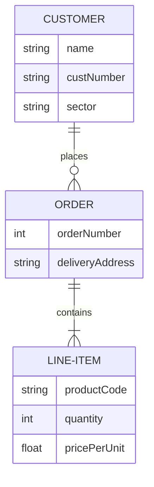

## Assignment  
## Task 1: 

Functions.
* Learn the project from  <a href="https://github.com/NurulloSulaymonov/DapperCrud" target="_blank">Last Practice</a>
* 
* Use Clean Arcitecture design (Domain,Infrastructure,Console).
* You have to create Service and perform methods of Get, GetById, Insert, Update, Delete.
* Learn the Dapper from <a href="https://www.learndapper.com/dapper-query" target="_blank">Dapper documentation</a>

Requirements:
* Create a new repository in your project. Name it with `homework_23.05.2023`
* Add gitignore into your project (`dotnet new gitignore`)

On average, this task can be completed in 2-3 hours, but you are welcome to spend more time on it to submit a better quality code.
  Make sure to send it until **23.05.2023T18:00**.
  Happy Coding 😊
